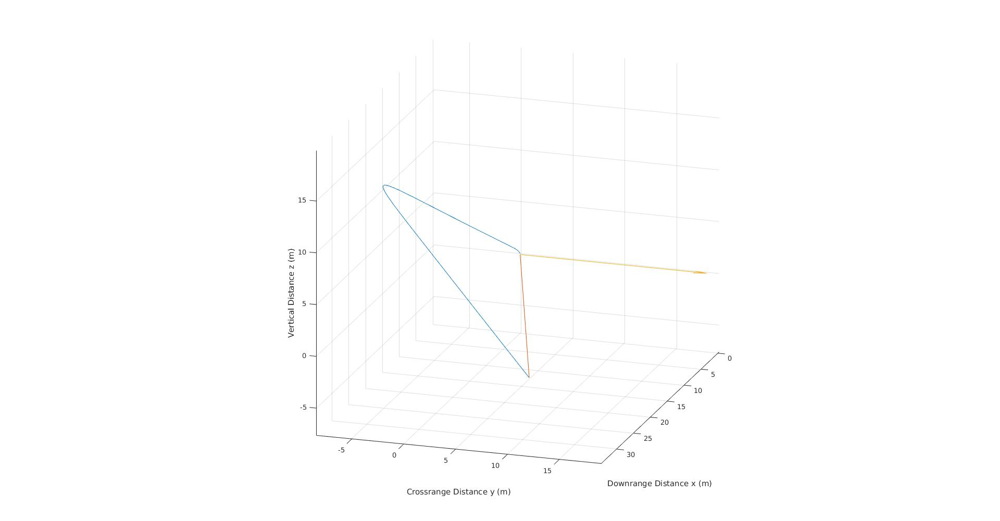

# Rocket Model

This is a thermodynamic model of a 2L water/air bottle rocket, written in MATLAB.
It accounts for wind and varying parameters such as the weight of the bottle, drag coefficients,
and the amount of water in the rocket.

Next on the works is validation and test programs to determine the optimal configuration.

